# 双端（APK ↔ AutoQuant exe）总览架构图

> 最后更新：2026-09-06
> 本图是**双端协作**的唯一权威总览。APK 单端 5 层细节见 `docs/architecture/index.html`（SVG）；
> exe 端模块逐文件地图见 `skills/autoquant/README.md`。
> 代码变更后请运行 `python skills/architecture-sync/scan_architecture.py` 对照更新。

## 一、整体拓扑（mermaid）

```mermaid
flowchart TB
    subgraph EXE["AutoQuant (Windows exe) — Python, 独立 git 仓库 AutoQuant/"]
        direction TB
        GUI["gui/app.py MainWindow<br/>右侧面板 10 个 QTabWidget 页签"]
        GUI -.- AITAB["🤖 AI助手 ChatWidget"]
        GUI -.- AGENTTAB["🤖 Agent(AgentTab)<br/>plan/review/suggest/多Agent"]
        GUI -.- RESULT["📈 回测结果"]
        GUI -.- STRATLIST["📋 策略列表"]
        GUI -.- MSGC["💬 消息消费 MsgConsumerTab"]
        GUI -.- HOLD["💼 持仓评估"]
        GUI -.- ETFTAB["🧲 ETF低位 EtfTab"]
        GUI -.- STOCKTAB["📊 股票 StockTab<br/>K线趋势/龙头自选"]
        GUI -.- SELPOS["🎯 选股建仓<br/>(含⏰选股推送守护)"]
        GUI -.- BTFIT["🔬 回测与拟合<br/>参数评估+滚动拟合"]

        ENGINES["引擎层"]
        PERIOD["period_selector 四周期选股"]
        DRAGON["dragon_filter 龙头"]
        SECTOR["SectorHotRanker 板块热度"]
        MACRO["macro_pipeline 宏观"]
        GUARD["market_guard 大盘门控"]
        PLAN["position_planner 建仓"]
        SELL["sell_engine 卖出"]
        TTRADE["t_trade_engine 做T"]
        EVAL["holding_evaluator 持仓评估"]
        ETFENGINE["smalltools/_etf_buy.py v0.3<br/>ETF低位引擎(独立工程)"]

        AGENT["agent_loop / autonomous_agent"]
        MULTA["multi_agent.py 多Agent编排<br/>父规划→子Agent执行→汇总"]
        TOOLS["agent_tools 工具注册表<br/>select_stocks/sector_rotation/<br/>realtime_quote/today_plan/..."]
        AGENT --> MULTA
        AGENT --> TOOLS

        SERVICES["服务层"]
        DATASVC["data_service.py DataService<br/>HTTP :8888（→ 仅本机）<br/>双端通讯改走 COS 中继"]
        REMOTE["remote_control.py 远程任务队列"]
        DATASVC -. "/etf_live /candidates /rotation /push" .-> APK
        REMOTE -. "任务提交/状态轮询" .-> APK
    end

    subgraph APK["StockAnalysis (Android) — Kotlin, 主 git 仓库 app/"]
        direction TB
        MAIN["MainActivity — 底部 5 Tab"]
        MAIN --- CHAT["对话 ChatTabFragment<br/>多AI并行/深度/专家/<br/>跨域→多Agent编排"]
        MAIN --- AGENT["智能体 AgentTabFragment<br/>自建Agent列表"]
        MAIN --- STOCK["股票 StockTabFragment"]
        MAIN --- QUANT["量化选股 StrategyFragment"]
        MAIN --- MINE["我的 SettingsFragment<br/>API配置/云同步/远程控制"]

        STOCK --- STK0["精选 WatchlistUnified<br/>自选/AI精选/备选池"]
        STOCK --- STK1["K线趋势 TrendChartTab"]
        STOCK --- STK2["热门行情 MarketHot<br/>全球指数+热门板块+龙头图谱"]
        STOCK --- STK3["热点新闻 HotNews"]

        QUANT --- WB["工作台 QuantWorkbenchFragment"]
        QUANT --- ST[("策略沙盒 StrategyListFragment")]
        QUANT --- DATAIM[("数据 StrategyImportFragment")]
        QUANT --- AIAN[("AI分析 AIAnalysisFragment")]

        WB --- P0["短线 QuantFragmentBase×周期"]
        WB --- P3["实仓 RealHoldingQuantFragment"]
        WB --- P4["🧲 ETF低位 EtfDipFragment<br/>PC桥 /etf_live"]

        AIHUB["agent/hub/AgentHub 10专家"]
        CHAT --> AIHUB
        WB -.-> CHAT
    end

    %% 参数单一事实源链路
    SELPOS & BTFIT --- EXPORT["export_params.py"]
    EXPORT ==>|"backtest_params.json<br/>(app assets 单一事实源)"| APK

    %% ETF 链路
    ETFENGINE ==>|"data/_etf_live_picks.json"| ETFTAB
    ETFENGINE -. "同文件/--live 生成" .-> DATASVC
    DATASVC ==>|"GET /etf_live"| P4

    %% 数据缓存
    AK["akshare / 腾讯 / 东财 push2"] --> EXE
    COS[("腾讯云 COS")] -. "云备份/同步" .-> APK
```

## 二、双端职责划分

| 维度 | AutoQuant (exe) | StockAnalysis (APK) |
|------|-----------------|---------------------|
| 定位 | PC 回测/拟合/选股/Agent 决策引擎 | 手机行情/工作台/对话/监控 |
| 语言 | Python + PyQt5 (matplotlib) | Kotlin + ViewBinding + Room |
| 数据 | akshare/东财实时 + `data/cache` 日K | 手机直连东财/腾讯 + PC 桥 |
| 参数源 | 产出方 → `app/src/main/assets/backtest_params.json` | 消费方（启动加载） |
| Agent | `agent_loop` 计划-执行 + `multi_agent.py` 多Agent | ChatTab 工具化 ReAct + AgentHub 专家 |
| 服务 | `data_service.py` HTTP :8888（⚠️ 将降为仅本机；双端通讯改走 COS 中继，不填 IP） | `PcBridgeClient` → 转发 `CosRelayClient`（待落地） |
| 构建 | `build_all.bat` (PyInstaller) | Gradle assembleDebug |

## 三、主链路

1. **参数链路**：exe 拟合 → `export_params.py` → `backtest_params.json` → APK 启动加载 + exe 回测回读。
2. **ETF 链路**：`smalltools/_etf_buy.py --live` → `_etf_live_picks.json` → exe `EtfTab` 直读 / APK 经 `data_service /etf_live` 拉取（双端同源同规则）。
3. **候选推送链路**：exe 选股推送守护 → `_publish_candidates.py`/COS → APK 工作台候选池。
4. **远程控制链路**：APK `RemoteControlDialog` 提交任务 → exe `remote_control.py` 队列执行 → 状态/日志回传。
5. **多 Agent 编排**：exe `multi_agent.py` 父规划拆解子 Agent；APK ChatTab 命中 ≥2 领域专家自动编排（`ChatAgent.orchestrateWithExperts`）。

## 四、GUI 页签对照（2026-09-06）

| APK 主 Tab / 子页 | exe 右侧页签 | 状态 |
|-------------------|-------------|------|
| 对话 ChatTab | 🤖 AI助手 / 🤖 Agent | 均有多 Agent |
| 智能体 | —（exe 以 Agent 面板代替） | 差异：apk 可自建 Agent |
| 股票·热门行情 | 🔥 板块热度 (2026-09) | 已对齐：exe `gui/market_hot_tab.py` 板块榜+成分龙头 |
| 股票·龙头图谱 | 📊 股票(龙头自选) + 🔥成分龙头 | 已对齐 |
| 股票·热点新闻 | 💬 消息消费(仅收发) | 差异：apk 有新闻列表+板块分析 |
| 量化选股·工作台 | 🎯 选股建仓 + 💼 持仓评估 | 对齐 |
| 实仓/ETF低位 | 💼 持仓评估 + 🧲 ETF低位 | 已对齐 |
| 我的·机构推荐OCR | — | exe 不适用（OCR 依赖手机端） |
