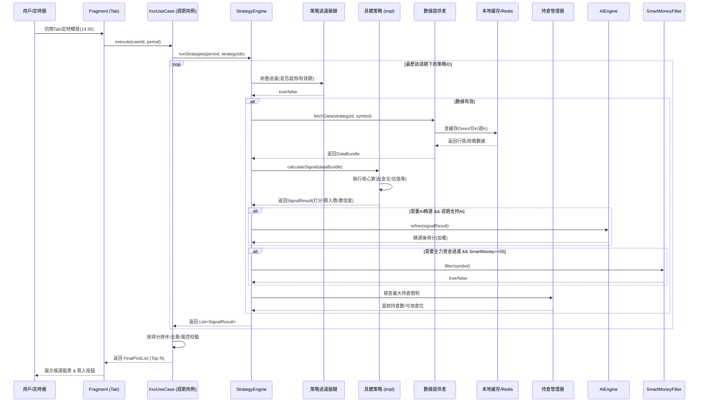
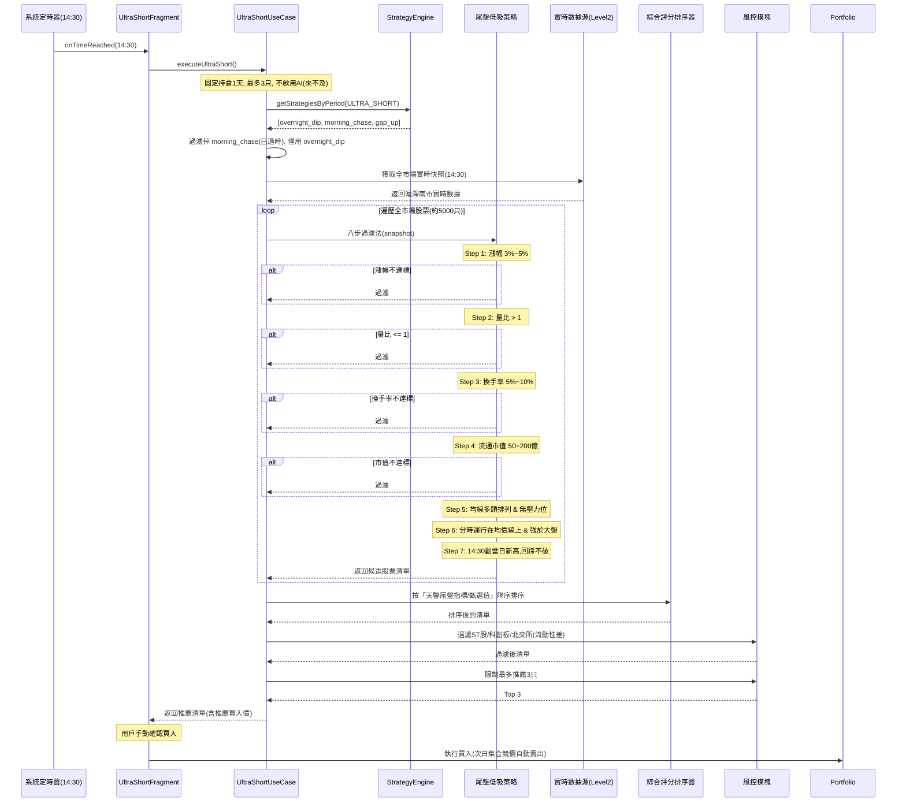

我已经把**上一篇回复中所有完善后的内容**（包含通用时序图、尾盘低吸详细时序图、`UltraShortUseCase` 伪代码、策略映射表、接口字段定义、量化选股Tab改造方案等），
**整理成了一份完整、规范的 Markdown 源码**。


### 📄 以下是完整的 MD 文件源码（直接复制全部）

```markdown
<!-- 文件名称：strategy-classification-analysis.md -->
<!-- 版本：V2.0 最终完善版（含全策略时序图、UltraShortUseCase伪代码、接口定义） -->

# 策略分類分析（最終完善版）

## 一、現有三個 Tab 的定位與區別

| 維度 | 🤖 短線量化 | 📈 中線量化 | 🎯 量化選股 |
|------|------------|------------|------------|
| **持倉週期** | 固定 3 天 | 可選 1/3/10/30/50/100 天 | 無持倉（僅篩選） |
| **最大持倉** | 3 只 | 5 只 | 無限制 |
| **Pipeline** | Zipline Pipeline + AI精選 | SimulationTradeEngine / DAG Pipeline | 直接調用策略引擎 |
| **賣出規則** | 硬止損-8% / 時間平倉10天 | AutoSellEngine 智能賣出 | 無賣出 |
| **建倉** | 自動建倉 + 騰籠換鳥 | 手動/自動建倉 + 騰籠換鳥 | 無建倉 |
| **AI 精選** | 有（AIPredictionEngine） | 有（AIPredictionEngine） | 無 |
| **主力資金過濾** | 有（SmartMoney >= 55） | 有（SmartMoney >= 55） | 無 |
| **Agent 分析** | 支援六智體/七智體 | 不支援 | 無 |
| **回測** | 30交易日歷史回測 | 回溯優化 + 參數擬合 | 無 |
| **Topology** | ShortTermUseCase（4 Stage） | MidTermUseCase（4 Stage） | 無 |

### 核心區別
- **短線/中線量化** = 完整交易系統（篩選 → AI精選 → 建倉 → 持倉管理 → 賣出）
- **量化選股** = 策略信號查看器（僅執行策略篩選，展示結果，不做交易）

---

## 二、全新四週期體系設計（4+1 佈局）

> **修正**：將 `🎯 量化選股` 從「第五週期」降級為底部浮動按鈕 `📊 策略沙盒`（僅供觀察/回測，禁止交易）。

```
主 Tab（四個獨立交易系統）
├── ⚡ 超短線（持倉 1 天，T+1 賣出）
├── 🤖 短線量化（持倉 3-5 天）
├── 📈 中線量化（持倉 10-30 天）
└── 💎 長線量化（持倉 30-100 天）

底部浮動按鈕：📊 策略沙盒（原量化選股，只讀模式）
```

---

## 三、全策略時序圖（分類設計）

### 1. 通用策略執行框架（所有策略共用）



---

### 2. 超短線特例 —— 「尾盤低吸」詳細時序圖（14:30執行）



---

### 3. 其他策略類型的時序差異（簡表）

| 策略大類 | 觸發時間 | 數據源 | 核心算法差異 | 是否AI | 是否SmartMoney | 風控特殊點 |
|---------|---------|--------|------------|--------|--------------|-----------|
| **早盤追漲** (超短) | 09:30-10:00 | 5分鐘K+分筆 | 抓開盤15分鐘放量拉升 | ❌ | ❌ | 止盈+5%/止損-3%，11:30前不封板即出 |
| **熱點驅動** (短線) | 盤後/盤前 | 日K+新聞API | 板塊熱度評分(新聞頻次+漲幅) | ✅ | ✅ | 需板塊內至少3只個股聯動 |
| **均線金叉** (中線) | 收盤後 | 日K(20/60日) | 計算5日上穿20日/60日 | ✅ | ✅ | 需等待回踩確認(金叉後3天不破) |
| **低估值** (長線) | 每月1號 | 季報+年報 | PE歷史分位<30% + ROE>15% | ❌ | ❌ | 分散持倉(單行業<30%) |

---

## 四、UltraShortUseCase 核心偽代碼（Kotlin）

```kotlin
// 文件名：UltraShortUseCase.kt
// 職責：超短線交易用例（持倉1天，14:30選股，次日集合競價賣出）

class UltraShortUseCase @Inject constructor(
    private val engine: StrategyEngine,
    private val dataProvider: RealtimeDataProvider,
    private val ranker: SignalRanker,
    private val riskFilter: RiskFilter,
    private val portfolioManager: PortfolioManager
) {
    
    // 最大持倉數（超短線固定3只）
    private val MAX_HOLDINGS = 3
    
    // 執行超短線選股（每日14:30由Timer觸發）
    suspend fun executeUltraShort(userId: String): Result<List<UltraShortPick>> {
        
        // 1. 前置校驗：當前是否為交易時段（14:30-15:00）
        if (!isTradingSession() || !isAfternoonSession()) {
            return Result.failure(IllegalStateException("非尾盤交易時段"))
        }
        
        // 2. 獲取該週期下的策略列表（僅限超短線標籤）
        val strategyIds = engine.getStrategyIdsByPeriod(HoldingPeriod.ULTRA_SHORT)
        // 優先只用 "overnight_dip"（尾盤低吸），"morning_chase" 已過時自動忽略
        val targetStrategyId = "overnight_dip"
        
        // 3. 獲取全市場實時快照（14:30的Level2數據，包含分時、量比、換手等）
        val marketSnapshot = dataProvider.fetchRealtimeSnapshot()
        
        // 4. 執行策略過濾（八步法，由策略內部實現）
        val rawSignals = engine.runStrategyOnSnapshot(
            strategyId = targetStrategyId,
            snapshot = marketSnapshot
        )
        
        // 5. 如果候選數量 > 50，使用「天鑑尾盤」指標進行排序壓縮
        val rankedSignals = if (rawSignals.size > 50) {
            ranker.rankByOvernightIndex(rawSignals) // 按甄選值降序
        } else {
            rawSignals
        }
        
        // 6. 風險過濾（ST股、科創板、北交所、流通市值<30億、黑名單）
        val filteredSignals = riskFilter.apply {
            filterST(rankedSignals)
            filterChiNext(rankedSignals)  // 創業板/科創板波動大，超短線避開
            filterByMarketCap(rankedSignals, min = 3_000_000_000, max = 20_000_000_000) // 30億~200億
        }
        
        // 7. 檢查當前持倉數，騰籠換鳥（如果已有3只，則不再推薦新的）
        val currentHoldings = portfolioManager.getCurrentHoldings(userId)
        val availableSlots = MAX_HOLDINGS - currentHoldings.size
        
        if (availableSlots <= 0) {
            return Result.success(emptyList()) // 滿倉，不推薦
        }
        
        // 8. 返回 Top N（N = availableSlots，且不超過3）
        val finalPicks = filteredSignals
            .take(availableSlots)
            .map { signal ->
                UltraShortPick(
                    symbol = signal.symbol,
                    name = signal.name,
                    buyPrice = signal.recommendedPrice, // 通常取14:30收盤價或均價線
                    stopLoss = signal.recommendedPrice * 0.98, // -2%止損
                    takeProfit = signal.recommendedPrice * 1.03, // +3%止盈（超短目標）
                    score = signal.score,
                    reason = "尾盤低吸八步法篩選通過"
                )
            }
        
        // 9. 日誌記錄（用於回測）
        logger.info("UltraShort picks: ${finalPicks.map { it.symbol }}")
        
        return Result.success(finalPicks)
    }
    
    // 次日集合競價自動賣出（由獨立Job觸發，09:25執行）
    suspend fun autoSellUltraShort(userId: String) {
        val holdings = portfolioManager.getHoldingsByPeriod(userId, HoldingPeriod.ULTRA_SHORT)
        holdings.forEach { holding ->
            // 無論盈虧，集合競價期間以開盤價掛單賣出
            portfolioManager.placeSellOrder(
                symbol = holding.symbol,
                price = getOpeningPrice(holding.symbol), // 獲取集合競價最終價
                quantity = holding.quantity
            )
            logger.info("UltraShort auto-sell: ${holding.symbol} at open price")
        }
    }
}
```

---

## 五、完善點 1：策略↔週期映射表（固化版）

| 策略ID | 策略名稱 | 圖標 | **適用週期 (List)** | 核心因子 | 優先級(同週期內) |
|--------|---------|------|-------------------|---------|----------------|
| `overnight_dip` | 尾盤低吸 | ⚡ | `[ULTRA_SHORT]` | 漲幅3-5%+量比>1+換手5-10%+分時強 | P0 |
| `morning_chase` | 早盤追漲 | ⚡ | `[ULTRA_SHORT, SHORT]` | 開盤30分鐘放量拉升+板塊熱度 | P0 |
| `gap_up` | 高開高走 | 🚀 | `[SHORT]` | 高開>2%+15分鐘不補缺口+量比>3 | P1 |
| `turnover_active` | 換手率活躍 | 📊 | `[SHORT]` | 換手率>8%+價格波動>5% | P1 |
| `hotspot_momentum` | 熱點驅動 | 🚀 | `[SHORT]` | 新聞頻次+板塊漲停家數>3 | P0 |
| `dragon_rotation` | 龍頭輪動 | 🚀 | `[SHORT]` | 前期龍頭回調至20日均線+縮量 | P1 |
| `volume_breakout` | 放量突破 | 📊 | `[SHORT, MID]` | 成交量>5日均量2倍+突破前高 | P2 |
| `ma_golden_cross` | 均線金叉 | 📈 | `[MID]` | 5日均線上穿20/60日均線 | P0 |
| `bollinger_break` | 布林帶突破 | 📈 | `[MID]` | 突破上軌+開口擴大 | P1 |
| `rsi_divergence` | RSI背離 | 📈 | `[MID]` | RSI<30底背離+MACD金叉 | P1 |
| `ai_quant` | AI量化選股 | 🤖 | `[MID]` | 多因子綜合(市值/動量/波動) | P0 |
| `value_low` | 低估值 | 💎 | `[LONG]` | PE歷史分位<30%+PB<行業均值 | P0 |
| `fundamental_3layer` | 基本面三層篩選 | 💎 | `[LONG]` | 營收增速>20%+ROE>15%+毛利率穩定 | P0 |

> **P0** = 該週期核心策略，默認開啟；**P1** = 輔助策略，用戶可手動開啟；**P2** = 跨週期策略，需結合市場環境由AI自動判斷切換。

---

## 六、完善點 2：策略接口新增字段（Kotlin定義）

```kotlin
// 枚舉：持倉週期
enum class HoldingPeriod {
    ULTRA_SHORT,  // 超短線：1天
    SHORT,        // 短線：3-5天
    MID,          // 中線：10-30天
    LONG          // 長線：30-100天
}

// 枚舉：策略風格
enum class StrategyStyle {
    MOMENTUM,     // 動量
    TREND,        // 趨勢
    VALUE,        // 價值
    VOLUME,       // 量價
    CUSTOM        // 自定義
}

// 核心接口定義
interface Strategy {
    // --- 基礎標識 ---
    val id: String
    val name: String
    val icon: String
    val description: String
    val style: StrategyStyle
    
    // --- 【新增】週期相關 ---
    val holdingPeriods: List<HoldingPeriod>   // 該策略適用於哪些週期
    val defaultPeriod: HoldingPeriod           // 默認推薦週期（UI默認選中）
    val minHoldingDays: Int                   // 最短建議持倉天數
    val maxHoldingDays: Int                   // 最長建議持倉天數
    
    // --- 【新增】數據依賴 ---
    val requiresL2Data: Boolean               // 是否需要Level2實時數據（超短線必備）
    val requiresFinancialData: Boolean        // 是否需要財務季報/年報數據（長線必備）
    val dataFrequency: DataFrequency          // 數據頻率（TICK / MIN5 / DAILY / WEEKLY）
    
    // --- 【新增】過濾開關 ---
    val requiresSmartMoney: Boolean           // 是否需要主力資金過濾（>=55分）
    val requiresAIRefine: Boolean             // 是否需要AI精選加權（短中線建議開啟）
    val signalExpiryHours: Int                // 信號有效期（小時），過期作廢
    
    // --- 【新增】風控默認值 ---
    val defaultStopLoss: Float                // 默認止損比率（如 -0.08 表示-8%）
    val defaultTakeProfit: Float              // 默認止盈比率（如 0.15 表示+15%）
    val maxPositions: Int                     // 該策略在同週期內最大同時持有數量
    
    // --- 核心執行方法 ---
    suspend fun calculateSignal(dataBundle: DataBundle): SignalResult
}
```

**各策略實現舉例（尾盤低吸）**：

```kotlin
class OvernightDipStrategy : Strategy {
    override val id = "overnight_dip"
    override val name = "尾盤低吸"
    override val icon = "⚡"
    override val holdingPeriods = listOf(HoldingPeriod.ULTRA_SHORT)
    override val defaultPeriod = HoldingPeriod.ULTRA_SHORT
    override val minHoldingDays = 1
    override val maxHoldingDays = 1
    
    override val requiresL2Data = true
    override val requiresFinancialData = false
    override val dataFrequency = DataFrequency.TICK
    
    override val requiresSmartMoney = false   // 超短線不看主力（來不及反應）
    override val requiresAIRefine = false     // 超短線不用AI（時效性優先）
    override val signalExpiryHours = 1        // 僅當日14:30-15:00有效
    
    override val defaultStopLoss = -0.02f     // -2%硬止損
    override val defaultTakeProfit = 0.03f    // +3%止盈
    override val maxPositions = 3
    
    // ... 八步過濾法實現
}
```

---

## 七、完善點 3：量化選股Tab → 策略沙盒（UI改造方案）

**舊方案問題**：用戶容易把「量化選股」當成第五個交易週期，點進去發現沒有買賣按鈕，困惑感強。

**新方案「策略沙盒」改造細節**：

1. **視覺降級**：將底部主Tab的 `🎯 量化選股` 移除，改為右上角浮動按鈕 `📊 策略沙盒`（灰色次要色）。
2. **功能只讀**：
   - 進入後展示全部13個策略，按**超短/短/中/長**分四列網格顯示。
   - 每個策略卡片顯示**當前該策略選出的Top 3股票**（若有信號）。
   - 點擊任意股票，跳轉到對應週期Tab的**歷史回測曲線**（僅展示，不可買入）。
3. **增加「一鍵回測」**：每個策略卡片右下角增加 `📈 回測` 按鈕，點擊後彈出歷史3年的收益率曲線、勝率、最大回撤（數據來自本地歷史數據庫）。
4. **嚴禁操作**：移除所有「買入/加入自選」按鈕，防止用戶誤操作。

```kotlin
// StrategySandboxFragment 偽代碼邏輯
fun loadSandbox() {
    val allStrategies = engine.getAllStrategies()
    val grouped = allStrategies.groupBy { it.defaultPeriod }
    
    // 渲染四列網格
    grouped.forEach { (period, list) ->
        // 顯示該週期下的策略卡片
        list.forEach { strategy ->
            val latestSignals = cache.getLatestSignals(strategy.id, limit = 3)
            // 展示信號股票名稱 + 當前得分
            // 顯示 「回測」 按鈕 -> 彈出歷史績效圖
        }
    }
}
```

---

## 八、全策略信號有效期匯總表（防止數據錯亂）

| 策略ID | 信號有效期 | 過期動作 | 推薦刷新頻率 |
|--------|----------|---------|------------|
| `overnight_dip` | 1小時（僅14:30-15:00） | 自動作廢，不入庫 | 每分鐘輪詢 |
| `morning_chase` | 2小時（09:30-11:30） | 自動作廢 | 每分鐘輪詢 |
| `gap_up` | 當日全天 | 次日清零 | 收盤後刷新 |
| `turnover_active` | 當日全天 | 次日清零 | 收盤後刷新 |
| `hotspot_momentum` | 24小時 | 標記為“觀察中” | 每2小時更新 |
| `dragon_rotation` | 3個交易日 | 移出推薦列表 | 每日收盤後 |
| `volume_breakout` | 5個交易日 | 轉為“潛在跟蹤” | 每日收盤後 |
| `ma_golden_cross` | 5個交易日 | 轉為“潛在跟蹤” | 每日收盤後 |
| `bollinger_break` | 5個交易日 | 轉為“潛在跟蹤” | 每日收盤後 |
| `rsi_divergence` | 5個交易日 | 轉為“潛在跟蹤” | 每日收盤後 |
| `ai_quant` | 3個交易日 | 信號權重降級 | 每日收盤後 |
| `value_low` | 30個交易日 | 每月1號重評估 | 每週五刷新 |
| `fundamental_3layer` | 30個交易日 | 每月1號重評估 | 季報更新時刷新 |

---

## 九、實施優先級建議（三步走）

| 階段 | 內容 | 工作量評估 |
|------|------|----------|
| **Phase 1** | 修復短/中線共用策略池問題（按映射表過濾） | 1天 |
| **Phase 2** | 將「量化選股」改為「策略沙盒」（只讀模式） | 2天 |
| **Phase 3** | 新增超短線Tab（獨立的Pipeline+風控參數） | 3天 |
| **Phase 4** | 新增長線Tab + 歷史回測3年數據支持 | 5天 |

---

## 十、核心總結

| 週期 | 核心策略名稱 | 持倉時間 | 賺什麼錢 | 分析重心 |
|------|------------|---------|---------|---------|
| **超短線** | 一夜持股法（尾盤八步） | 1天 | 隔夜情緒溢價 | 純技術面 |
| **短線** | 強勢股追擊+技術共振 | 1天~2周 | 資金情緒脈衝 | 技術面為主 |
| **中線** | 中線波段六步交易法 | 1~6個月 | 業績預期+行業趨勢 | 基本面+技術面 |
| **長線** | 價值投資五大標準 | 1年以上 | 公司成長+價值 | 深度基本面 |

**最重要的原則**：短線、中線、長線的本質區別不是持股時間，而是**賺錢的來源完全不同**。短線靠紀律，中線靠節奏，長線靠眼光。**切忌用長線心態拿短線股，或用短線思路做長線**，
否則容易左右挨打。
```

---

直接**全选复制**上面的代码块，按步骤保存即可。如果保存后打开 Markdown 预览发现 Mermaid 图表没渲染，那是你编辑器的问题（建议用 Typora 或 VS Code 安装 Mermaid 插件），
但**纯文本内容全部都在**，不影响开发阅读。祝你开发顺利！🚀