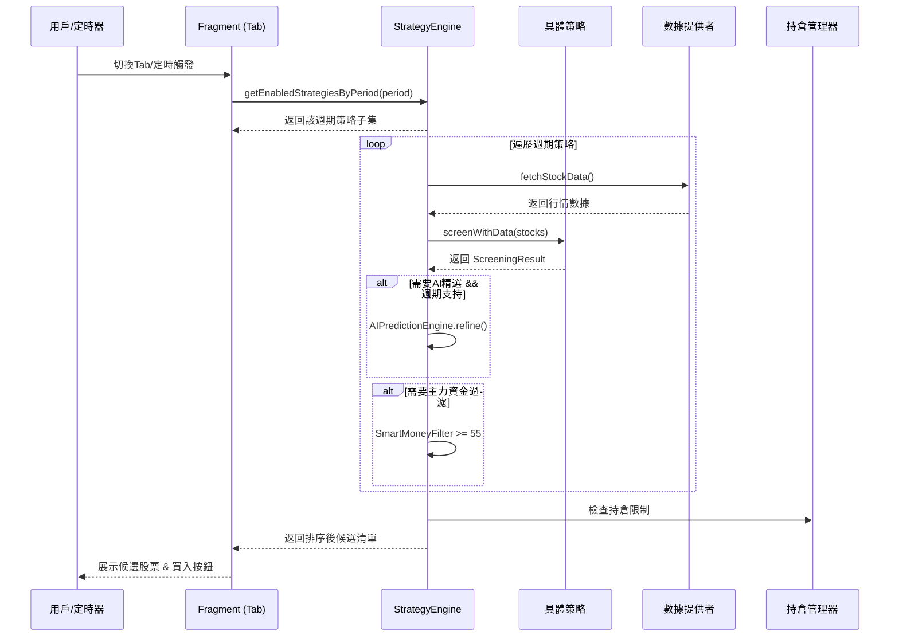

<!-- 文件原名：策略分類分析.md -->

# 策略分類分析與實現計劃（V2.0）

## 一、現有三個 Tab 的定位與區別

| 維度 | 🤖 短線量化 | 📈 中線量化 | 🎯 量化選股 |
|------|------------|------------|------------|
| **持倉週期** | 固定 3 天 | 可選 1/3/10/30/50/100 天 | 無持倉（僅篩選） |
| **最大持倉** | 3 只 | 5 只 | 無限制 |
| **Pipeline** | Zipline Pipeline + AI精選 | SimulationTradeEngine / DAG Pipeline | 直接調用策略引擎 |
| **賣出規則** | 硬止損-8% / 時間平倉10天 | AutoSellEngine 智能賣出 | 無賣出 |
| **建倉** | 自動建倉 + 騰籠換鳥 | 手動/自動建倉 + 騰籠換鳥 | 無建倉 |
| **AI 精選** | 有（AIPredictionEngine） | 有（AIPredictionEngine） | 無 |
| **主力資金過濾** | 有（SmartMoney >= 55） | 有（SmartMoney >= 55） | 無 |
| **Agent 分析** | 支援六智體/七智體 | 不支援 | 無 |
| **回測** | 30交易日歷史回測 | 回溯優化 + 參數擬合 | 無 |
| **Topology** | ShortTermUseCase（4 Stage） | MidTermUseCase（4 Stage） | 無 |

### 核心區別
- **短線/中線量化** = 完整交易系統（篩選 → AI精選 → 建倉 → 持倉管理 → 賣出）
- **量化選股** = 策略信號查看器（僅執行策略篩選，展示結果，不做交易）

---

## 二、現有 14 個策略（已註冊到引擎）

### 按類別分佈

| 類別 | icon | 策略（id → 名稱） |
|------|------|------|
| **TREND 趨勢類** | 📈 | `ma_golden_cross` 均線金叉、`bollinger_band` 布林帶突破 |
| **MOMENTUM 動量類** | 🚀 | `gap_up_momentum` 高開高走、`rsi_divergence` RSI背離、`early_morning_chase` 早盤追漲、`hotspot_driven` 熱點驅動、`dragon_head_dip` 龍頭輪動 |
| **VALUE 價值類** | 💎 | `low_valuation` 低估值、`fundamental_filter` 基本面三層篩選、`institutional_accumulation` 機構增持、`moat_leader` 行業龍頭護城河 |
| **VOLUME 量價類** | 📊 | `volume_break` 放量突破、`turnover_active` 換手率活躍、`smart_money_detection` 主力資金 |
| **CUSTOM 自定義** | 🔧 | `tail_low_pick` 尾盤低吸、`ai_prediction` AI量化選股 |

### 當前代碼問題

短線量化和中線量化使用**完全相同的策略池**：

```kotlin
// ShortTermQuantFragment.kt:312-313 — 僅排除 ai_prediction
for (strategy in eng.getStrategies()) {
    if (!eng.isEnabled(strategy.id) || strategy.id == "ai_prediction") continue

// MidTermQuantFragment.kt:207 — 全部啟用策略
val strategies = eng.getStrategies().filter { eng.isEnabled(it.id) }
```

**後果**：短線量化會跑到低估值/基本面等長線策略，中線量化會跑到尾盤低吸等超短線策略，信號混亂。

---

## 三、四週期體系設計

### 總體架構（4+1 佈局）

```
策略 Tab（四個獨立交易系統）
├── ⚡ 超短線（持倉 1 天，T+1 賣出）
├── 🤖 短線量化（持倉 1天~2周）
├── 📈 中線量化（持倉 1~6個月）
└── 💎 長線量化（持倉 1年以上）

底部浮動入口：🎯 量化選股（策略沙盒，只讀模式）
```

### 各週期定義

| 週期 | 持倉 | 適合場景 | 策略特點 |
|------|------|---------|---------|
| **超短線** | 1 天 | 强势市场、板塊輪動快 | 尾盤低吸、早盤追漲、日内動量 |
| **短線** | 1天~2周 | 震荡市、板塊輪動 | 放量突破、換手率活躍、熱點驅動、龍頭輪動 |
| **中線** | 1~6個月 | 趋势市、行情启动初期 | 均線金叉、布林帶突破、RSI背離、AI綜合選股 |
| **長線** | 1年以上 | 下跌末期、价值回归 | 低估值、基本面三層篩選 |

---

## 四、策略 ↔ 週期映射表（基於實際策略 ID）

| 策略 ID | 策略名稱 | 適用週期 | 優先級 | 理由 |
|---------|---------|---------|--------|------|
| `tail_low_pick` | 尾盤低吸 | `ULTRA_SHORT` | P0 | 14:30 尾盤低吸，次日賣出 |
| `early_morning_chase` | 早盤追漲 | `ULTRA_SHORT` | P0 | 開盤30分鐘追漲，日內 |
| `gap_up_momentum` | 高開高走 | `SHORT` | P1 | 日內動量突破，1-3天 |
| `turnover_active` | 換手率活躍 | `SHORT` | P1 | 成交活躍，1-3天 |
| `hotspot_driven` | 熱點驅動 | `SHORT` | P0 | 板塊熱度+新聞，1-3天 |
| `dragon_head_dip` | 龍頭輪動 | `SHORT` | P0 | 震蕩期龍頭低吸，1-3天 |
| `volume_break` | 放量突破 | `SHORT, MID` | P2 | 放量突破前高，3-15天 |
| `ma_golden_cross` | 均線金叉 | `MID` | P0 | 5/20日均線，5-10天 |
| `bollinger_band` | 布林帶突破 | `MID` | P1 | 趨勢確認，5-15天 |
| `rsi_divergence` | RSI背離 | `MID` | P1 | 底部反轉，5-15天 |
| `ai_prediction` | AI量化選股 | `MID` | P0 | 多因子綜合，5-15天 |
| `low_valuation` | 低估值 | `LONG` | P0 | 價值回归，30天+ |
| `fundamental_filter` | 基本面篩選 | `LONG` | P0 | 基本面分析，30天+ |
| `institutional_accumulation` | 機構增持 | `LONG` | P1 | 高ROE+低負債+穩健現金流 |
| `moat_leader` | 行業龍頭護城河 | `LONG` | P0 | 技術壁壘+龍頭地位+高毛利 |
| `smart_money_detection` | 主力資金 | `MID` | P2 | 主力資金追蹤，輔助過濾 |

> **P0** = 該週期核心策略，默認開啟；**P1** = 輔助策略；**P2** = 跨週期策略。

---

## 五、實現方案（基於現有代碼結構）

### 設計原則
1. **向後兼容** — `Strategy` 接口新增屬性帶默認值，現有策略不需立即全部修改
2. **最小改動** — 復用 `StrategyEngine`、`QuantFragmentBase` 等現有架構
3. **漸進式** — 先修復策略池問題，再擴展四週期

### Step 1：新增 `HoldingPeriod` 枚舉

在 `Strategy.kt` 中新增：

```kotlin
/** 持倉週期 */
enum class HoldingPeriod(val label: String, val icon: String, val holdingDays: IntRange) {
    ULTRA_SHORT("超短線", "⚡", 1..1),
    SHORT("短線", "🤖", 1..14),       // 1天~2周
    MID("中線", "📈", 30..180),        // 1~6個月
    LONG("長線", "💎", 180..999)        // 1年以上（用大數值表示無固定上限）
}
```

### Step 2：`Strategy` 接口增加週期屬性（帶默認值）

```kotlin
interface Strategy {
    // ... 現有屬性不變 ...

    /** 策略適用的持倉週期（默認短線，向後兼容） */
    val holdingPeriods: List<HoldingPeriod>
        get() = listOf(HoldingPeriod.SHORT)

    /** 默認推薦週期 */
    val defaultPeriod: HoldingPeriod
        get() = holdingPeriods.first()
}
```

> 接口屬性帶 `get()` 默認實現，現有 14 個策略不修改也能編譯通過，默認歸為短線。

### Step 3：各策略覆寫 `holdingPeriods`

```kotlin
// 尾盤低吸
override val holdingPeriods = listOf(HoldingPeriod.ULTRA_SHORT)

// 龍頭輪動
override val holdingPeriods = listOf(HoldingPeriod.SHORT)

// 均線金叉
override val holdingPeriods = listOf(HoldingPeriod.MID)

// 低估值
override val holdingPeriods = listOf(HoldingPeriod.LONG)

// 放量突破（跨週期）
override val holdingPeriods = listOf(HoldingPeriod.SHORT, HoldingPeriod.MID)
```

### Step 4：`StrategyEngine` 新增週期過濾方法

```kotlin
class StrategyEngine(...) {
    // ... 現有方法不變 ...

    /** 獲取指定週期的啟用策略 */
    fun getEnabledStrategiesByPeriod(period: HoldingPeriod): List<Strategy> =
        strategies.values.filter { 
            isEnabled(it.id) && period in it.holdingPeriods 
        }

    /** 獲取指定週期的全部策略（含未啟用） */
    fun getStrategiesByPeriod(period: HoldingPeriod): List<Strategy> =
        strategies.values.filter { period in it.holdingPeriods }
}
```

### Step 5：修改 Fragment 策略過濾邏輯

```kotlin
// ShortTermQuantFragment.kt — 短線量化僅用 SHORT 週期策略
for (strategy in eng.getEnabledStrategiesByPeriod(HoldingPeriod.SHORT)) {
    // 不再需要手動排除 ai_prediction，由週期過濾自動處理
    val r = strategy.screenWithData(stocks)
    // ...
}

// MidTermQuantFragment.kt — 中線量化僅用 MID 週期策略
val strategies = eng.getEnabledStrategiesByPeriod(HoldingPeriod.MID)
```

### Step 6：量化選股 Tab 改造（策略沙盒）

將 `StrategyListFragment` 改為按四週期分組展示，只讀模式：

```kotlin
fun loadSandbox() {
    val allStrategies = engine.getStrategies()
    val grouped = HoldingPeriod.values().associateWith { period ->
        allStrategies.filter { period in it.holdingPeriods }
    }
    // 渲染四列：超短線 | 短線 | 中線 | 長線
    // 每個策略卡片顯示最近信號 Top 3，點擊可查看回測
    // 移除所有買入按鈕
}
```

---

## 六、新增超短線 / 長線 Tab 的擴展方案

### 超短線 Tab（`UltraShortQuantFragment`）

繼承 `QuantFragmentBase`，核心差異：

| 配置項 | 超短線 | 短線（現有） |
|--------|--------|------------|
| 持倉天數 | 1 天（T+1 賣出） | 1天~2周 |
| 最大持倉 | 3 只 | 3 只 |
| AI 精選 | 關閉（時效優先） | 開啟 |
| 策略池 | `ULTRA_SHORT` 週期 | `SHORT` 週期 |
| 執行時機 | 14:30 定時觸發 | 手動/盤後 |
| 止損/止盈 | -2% / +3% | -8% / 時間平倉 |

### 長線 Tab（`LongTermQuantFragment`）

繼承 `QuantFragmentBase`，核心差異：

| 配置項 | 長線 | 中線（現有） |
|--------|------|------------|
| 持倉天數 | 1年以上 | 1~6個月 |
| 最大持倉 | 5 只 | 5 只 |
| 策略池 | `LONG` 週期 | `MID` 週期 |
| 數據頻率 | 週K + 季報 | 日K |
| 賣出規則 | 基本面惡化 / 估值過高 | AutoSellEngine |

---

## 七、通用策略執行時序



---

## 八、雙路線架構設計（Legacy + Agent）

### 設計目標

每個週期 Tab 同時支持兩種執行路線，用戶可通過 `FeatureFlagManager` 切換：

| 路線 | 執行引擎 | 特點 | 適用場景 |
|------|---------|------|---------|
| **Legacy** | `StrategyEngine` → 策略 `screenWithData()` | 快速、本地計算、無 AI 依賴 | 盤中快速篩選、離線回測 |
| **Agent** | `UnifiedAgentRunner` / `AgentPipelineOrchestrator` | 深度分析、多智體協作、AI 驅動 | 盤後深度研究、個股精選 |

### 雙路線切換流程

```
用戶選擇週期 Tab（超短/短/中/長）
    │
    ├── FeatureFlagManager.getRoute(period) == LEGACY?
    │       │
    │       └── YES → StrategyEngine.getEnabledStrategiesByPeriod(period)
    │                   → 各策略 screenWithData() 並發執行
    │                   → 結果排序 → 建倉/持倉/賣出
    │
    └── NO → Agent 路線
                │
                ├── mode == QUICK → UnifiedAgentRunner(MODE_QUICK)
                │                   → StockAnalysisAgent + RiskManagementAgent 並行
                │
                ├── mode == PIPELINE → AgentPipelineOrchestrator
                │                      → 六智體/七智體流水線
                │
                └── mode == V2 → V2AgentRunner
                                  → 全周期投研（市場環境+利潤質量+決策矩陣）
```

### Legacy 路線（現有架構，保持不動）

```kotlin
// 各 Tab Fragment 中的 Legacy 執行邏輯
fun executeLegacy(period: HoldingPeriod) {
    val strategies = engine.getEnabledStrategiesByPeriod(period)
    engine.runAllWithData(scope, stocks) { result ->
        // 結果排序、AI 精選（可選）、建倉
    }
}
```

### Agent 路線（opencode 模式設計）

借鑑 opencode 的「配置驅動 + 可插拔」理念，Agent 模式通過配置文件定義執行流程：

```kotlin
// agent 配置文件：assets/usecases/ultra_short_agent.json
{
  "period": "ULTRA_SHORT",
  "mode": "QUICK",
  "agents": ["StockAnalysisAgent", "RiskManagementAgent"],
  "parallel": true,
  "timeout": 30,
  "postProcess": {
    "sortBy": "strength",
    "maxResults": 3,
    "stopLoss": -0.02,
    "takeProfit": 0.03
  }
}

// agent 配置文件：assets/usecases/mid_agent.json
{
  "period": "MID",
  "mode": "PIPELINE",
  "pipelineMode": "AUTO",  // AUTO = AI 自動選擇六智體/七智體
  "steps": "from_orchestrator",
  "timeout": 120,
  "postProcess": {
    "sortBy": "overallScore",
    "maxResults": 5,
    "autoSellEngine": true
  }
}
```

```kotlin
// AgentRouteExecutor — 統一 Agent 執行入口
class AgentRouteExecutor(private val context: Context) {

    /** 根據週期加載 agent 配置並執行 */
    suspend fun execute(period: HoldingPeriod, stocks: List<StockRealtime>): AgentResult {
        val config = loadAgentConfig(period)  // 從 assets/usecases/ 讀取 JSON
        return when (config.mode) {
            "QUICK" -> executeQuick(config, stocks)
            "PIPELINE" -> executePipeline(config, stocks)
            "V2" -> executeV2(config, stocks)
            else -> throw IllegalArgumentException("Unknown mode: ${config.mode}")
        }
    }

    private suspend fun executeQuick(config, stocks): AgentResult {
        val result = UnifiedAgentRunner.run(context, ..., mode = MODE_QUICK)
        return applyPostProcess(result, config.postProcess)
    }

    private suspend fun executePipeline(config, stocks): AgentResult {
        val orchestrator = AgentPipelineOrchestrator(context)
        val result = orchestrator.execute(...)
        return applyPostProcess(result, config.postProcess)
    }
}
```

### 各週期的 Agent 模式推薦

| 週期 | 推薦 Agent 模式 | 理由 |
|------|----------------|------|
| **超短線** | `QUICK` | 時效優先，2 Agent 並行 30 秒內完成 |
| **短線** | `QUICK` 或 `PIPELINE` | 盤後可用 PIPELINE 深度分析 |
| **中線** | `PIPELINE` | 六智體/七智體深度分析，適合中線選股 |
| **長線** | `V2` | 全周期投研，市場環境+利潤質量+決策矩陣 |

### FeatureFlagManager 擴展

```kotlin
// 為每個週期新增獨立的 route 開關
object FeatureFlagManager {
    // 現有：全局開關
    var useAgentFramework: Boolean

    // 新增：按週期獨立開關
    fun getRoute(period: HoldingPeriod): AgentRoute {
        return when (period) {
            HoldingPeriod.ULTRA_SHORT -> getEnum("route_ultra_short", AgentRoute.LEGACY)
            HoldingPeriod.SHORT -> getEnum("route_short", AgentRoute.LEGACY)
            HoldingPeriod.MID -> getEnum("route_mid", AgentRoute.LEGACY)
            HoldingPeriod.LONG -> getEnum("route_long", AgentRoute.LEGACY)
        }
    }

    // 新增：Agent 子模式選擇
    fun getAgentMode(period: HoldingPeriod): String {
        return when (period) {
            HoldingPeriod.ULTRA_SHORT -> "QUICK"
            HoldingPeriod.SHORT -> "QUICK"
            HoldingPeriod.MID -> "PIPELINE"
            HoldingPeriod.LONG -> "V2"
        }
    }
}
```

### UI 切換入口

在設置頁面新增「策略執行路線」區塊：

```
[設置] → [策略執行路線]
├── 全局模式: [全部 Legacy] [全部 Agent] [按週期配置]
├── 超短線: [Legacy] [Agent(QUICK)]
├── 短線:   [Legacy] [Agent(QUICK)] [Agent(PIPELINE)]
├── 中線:   [Legacy] [Agent(PIPELINE)]
└── 長線:   [Legacy] [Agent(V2)]
```

---

## 九、分階段實施計劃（完整版）

### 總時間估算：約 13 個工作日（2.5 週）

> ✅ **全部 10 個 Phase 已實現完成**（2026-07-25）

| 階段 | 內容 | 改動範圍 | 狀態 |
|------|------|---------|------|
| **Phase 1** | 新增 `HoldingPeriod` 枚舉 + `Strategy` 接口擴展 | `Strategy.kt` | ✅ 完成 |
| **Phase 2** | 16 個策略覆寫 `holdingPeriods` | `strategies/*.kt` | ✅ 完成 |
| **Phase 3** | `StrategyEngine` 新增週期過濾方法 | `StrategyEngine.kt` | ✅ 完成 |
| **Phase 4** | 短線/中線 Fragment 改用週期過濾（修復策略池問題） | `ShortTermQuantFragment.kt`、`MidTermQuantFragment.kt` | ✅ 完成 |
| **Phase 5** | 量化選股 → 策略沙盒改造（按週期分組展示） | `StrategyListFragment.kt` | ✅ 完成 |
| **Phase 6** | 新增超短線 Tab（`UltraShortQuantFragment`） | 新建 Fragment + Tab 註冊 | ✅ 完成 |
| **Phase 7** | 新增長線 Tab（`LongTermQuantFragment`） + 5 Tab 佈局 | `LongTermQuantFragment.kt`、`StrategyFragment.kt` | ✅ 完成 |
| **Phase 8** | Legacy/Agent 雙路線整合 + `AgentRouteExecutor` | `FeatureFlagManager.kt`、新建 `AgentRouteExecutor.kt` | ✅ 完成 |
| **Phase 9** | Agent opencode 模式（JSON 配置 + 多模式支持） | `assets/usecases/*_agent.json`、`AgentRouteExecutor.kt` | ✅ 完成 |
| **Phase 10** | 設置頁 UI（路線切換） + 全鏈路測試 | `SettingsFragment.kt`、`fragment_settings.xml` | ✅ 完成 |

### 各 Phase 實現摘要

| Phase | 核心改動 |
|-------|---------|
| 1 | `HoldingPeriod` 枚舉：ULTRA_SHORT(1天)、SHORT(1~14天)、MID(30~180天)、LONG(180~999天)；`Strategy.holdingPeriods` 屬性默認 SHORT |
| 2 | 16 個策略覆寫 `holdingPeriods`，按週期分類（超短線/短線/中線/長線） |
| 3 | `StrategyEngine.getEnabledStrategiesByPeriod()` + `getStrategiesByPeriod()` 週期過濾 |
| 4 | 短線/中線 Fragment 改用 `getEnabledStrategiesByPeriod()`，解決策略池混淆 |
| 5 | 量化選股 → 策略沙盒，按週期分組展示 |
| 6 | `UltraShortQuantFragment`：尾盤低吸、T+1 自動賣出、止損-2%/止盈+3% |
| 7 | `LongTermQuantFragment`：價值投資、基本面健康檢查、止損-20%/止盈+50%；`StrategyFragment` 升級為 5 Tab |
| 8 | `FeatureFlagManager` 新增按週期路線開關；`AgentRouteExecutor` 統一 Agent 執行入口（QUICK/PIPELINE/V2） |
| 9 | 4 個 JSON 配置文件（`ultra_short_agent.json` 等）；opencode 配置驅動：agents、parallel、timeout、maxBatchSize、postProcess |
| 10 | 設置頁新增「週期級別路線」4 個開關（超短線/短線/中線/長線）；全局模式聯動週期路線；HYBRID 模式下可獨立配置 |

### 優先級說明

- **Phase 1-4（2 天）= 核心修復** — 解決短線/中線策略池混淆，風險最低，收益最大
- **Phase 5-7（5 天）= 四週期擴展** — 新增超短線/長線 Tab，完成四週期體系
- **Phase 8-10（6 天）= 雙路線 + Agent 模式** — Legacy/Agent 切換，opencode 配置驅動

### 建議實施順序

```
第 1 週：Phase 1-4（核心修復）+ Phase 5（策略沙盒）
第 2 週：Phase 6-7（超短線/長線 Tab）
第 3 週：Phase 8-10（雙路線 + Agent opencode 模式）
```

---

## 十、風險與注意事項

- **超短線需要即時數據** — 盤中 14:30 才能執行尾盤低吸，離線數據無效
- **長線策略信號少** — 低估值/基本面策略觸發頻率低，需耐心
- **策略跨週期問題** — `volume_break` 同時適合短線和中線，用 `List<HoldingPeriod>` 靈活標記
- **向後兼容** — 接口新增屬性帶默認值，未覆寫的策略默認歸為 `SHORT`，不會編譯報錯
- **Pipeline 適配** — 超短線/長線 Tab 新增後需配置對應的 UseCase XML（`assets/usecases/`）
- **信號有效期** — 超短線信號 1 小時過期，長線信號 30 天，需在策略層處理
- **雙路線數據一致性** — Legacy 和 Agent 路線返回的結果結構需統一（`AgentResult` 適配 `ScreeningResult`）
- **Agent 模式依賴 AI API** — Agent 路線需要配置 AI API Key，離線環境只能用 Legacy
- **opencode 配置校驗** — JSON 配置文件需校驗合法性，避免運行時崩潰

---

## 十一、核心總結

### 方法論總覽

| 週期 | 核心策略名稱 | 持倉時間 | 賺什麼錢 | 分析重心 |
|------|------------|---------|---------|---------|
| **超短線** | 一夜持股法（尾盤八步） | 1 天 | 隔夜情緒溢價 | 純技術面 |
| **短線** | 強勢股追擊+技術共振 | 1天~2周 | 資金情緒脈衝 | 技術面為主 |
| **中線** | 中線波段六步交易法 | 1~6個月 | 業績預期+行業趨勢 | 基本面+技術面 |
| **長線** | 價值投資五大標準 | 1年以上 | 公司成長+價值 | 深度基本面 |

### 各週期具體策略

| 週期 | 策略列表 |
|------|---------|
| **超短線** | 尾盤低吸、早盤追漲 |
| **短線** | 龍頭輪動、熱點驅動、放量突破 |
| **中線** | 均線金叉、布林帶、AI量化 |
| **長線** | 低估值、基本面篩選、機構增持、行業龍頭護城河 |

**最重要原則**：短線靠紀律，中線靠節奏，長線靠眼光。切忌用長線心態拿短線股，或用短線思路做長線。
