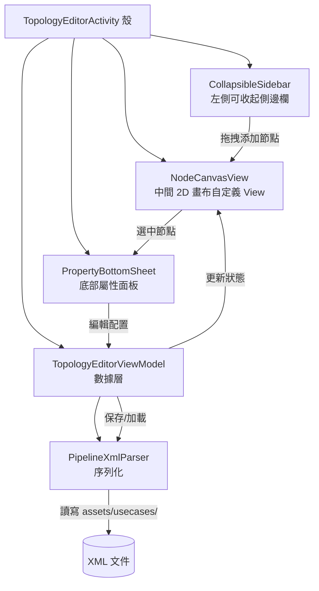
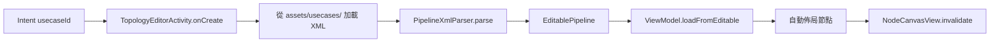

# Pipeline 拓撲編輯器設計文檔

> 本文檔描述 StockAnalysis Android 應用中全新 Pipeline 拓撲編輯器的完整設計。該編輯器取代舊版「點選連線」交互方式，改以 2D 畫布 + 端口拖拽連線的直觀操作模式，讓用戶能夠以可視化方式構建與維護股票分析流水線。

---

## 1. 設計目標

- **零文本操作**：用戶只需點擊 / 拖拽即可完成所有 Node 添加、刪除、修改、連線，無需手寫 XML。
- **四層側邊欄**：可收起側邊欄存儲 `Node` / `LinkList` / `Pipeline` / `UseCase` 四層結構，支持層級展開與當前上下文高亮。
- **上下文感知**：從短線 Tab 進入自動加載 `short_term_pipeline`；從中線 Tab 進入自動加載 `mid_term_pipeline`，避免用戶手動選擇。
- **2D 自由畫布**：支持畫布上下左右滾動 + 雙指縮放，適配任意規模的拓撲圖。
- **端口拖拽連線**：節點端口支持長按拖拽，鬆手即可建立連線，連線方向與數據流一致。

---

## 2. 架構概覽

整體採用「殼 Activity + 可收起側邊欄 + 自定義畫布 View + 底部屬性面板 + ViewModel 數據層 + XML 序列化」的分層結構。UI 層只負責渲染與手勢，所有狀態收斂到 `TopologyEditorViewModel`，持久化通過 `PipelineXmlParser` 完成。

---

## 3. 核心組件

### 3.1 NodeCanvasView

- 自定義 View，繼承 `View`，承擔全部繪製與手勢處理。
- **onDraw 繪製**：節點矩形（按 `NodeType` 著色，見第 6 節）+ 貝塞爾曲線連線（`Path.cubicTo`）。
- **手勢**：`ScaleGestureDetector`（縮放）+ `GestureDetector`（平移、點擊、長按）。
- **變換矩陣**：`scale + translate`，維護世界座標 ↔ 屏幕座標互轉函數 `worldToScreen()` / `screenToWorld()`。
- **連線交互**：長按端口 → 拖到目標端口 → 鬆手建連；拖拽過程中繪製臨時貝塞爾曲線預覽。
- **節點交互**：點擊選中、長按彈出菜單（配置 / 刪除）、拖拽移動。

### 3.2 CollapsibleSidebar

- 左側側邊欄，可收起為 `20dp` 窄條，展開寬度約 `240dp`。
- **4 層結構**：`Node → LinkList → Pipeline → UseCase`，自頂向下層級遞進。
- 每層顯示可用項目，長按拖拽到畫布即可添加。
- 當前 `UseCase` 高亮顯示，並展示其關聯的 Pipeline / LinkList / Node 鏈路。

### 3.3 PropertyBottomSheet

- 底部彈出面板（替代右側屬性欄），採用 `BottomSheetDialogFragment` 實現。
- 顯示選中節點的 `module` / `config` / `nodeId`。
- 支持編輯配置鍵值對，鍵為只讀，值根據類型提供對應輸入控件（文本 / 數字 / 布爾）。

### 3.4 TopologyEditorViewModel

- 管理節點列表、連線列表、選中狀態（單選節點 / 單選連線）。
- 加載 / 保存 XML（通過 `PipelineXmlParser`）。
- 節點位置座標管理（新增 `positionX` / `positionY` 字段，持久化到 XML）。
- 舊版連線模式（點選）改為端口拖拽，`ViewModel` 僅暴露 `addLink(fromId, fromPort, toId, toPort)` 介面。

---

## 4. 數據模型

| 數據類 | 說明 | 關鍵字段 |
|--------|------|---------|
| `VisualNode` | 畫布節點 | `id`, `module`, `name`, `x`, `y`, `width`, `height`, `nodeType` |
| `VisualLink` | 連線 | `fromId`, `toId`, `fromPort`, `toPort`, `label` |
| `NodeCanvasState` | 畫布狀態 | `scale`, `translateX`, `translateY`, `nodes`, `links` |
| `SidebarCategory` | 側邊欄分類 | `type`(NODE/LINKLIST/PIPELINE/USECASE), `items` |

> `VisualNode` 的 `x` / `y` 為世界座標，與屏幕座標通過 `NodeCanvasState` 的 `scale` 與 `translate` 換算。`nodeType` 決定節點著色（見第 6 節）。

---

## 5. 手勢交互設計

| 手勢 | 動作 |
|------|------|
| 單指拖拽（空白區域） | 平移畫布 |
| 雙指捏合 | 縮放畫布 |
| 點擊節點 | 選中節點 |
| 長按節點 | 彈出菜單（配置 / 刪除） |
| 拖拽節點 | 移動節點位置 |
| 長按節點右側端口 → 拖到目標端口 | 創建連線 |
| 點擊連線 | 選中連線（可刪除） |

> 為避免手勢衝突，優先級為：雙指縮放 > 端口拖拽 > 節點拖拽 > 畫布平移。`ScaleGestureDetector` 進行中時屏蔽單指事件。

---

## 6. 顏色方案

| NodeType | 顏色 | 說明 |
|----------|------|------|
| `DATA_SOURCE` | `#059669` (綠) | 數據源節點 |
| `STRATEGY` | `#7c3aed` (紫) | 策略節點 |
| `FILTER` | `#dc2626` (紅) | 過濾節點 |
| `AI` | `#2563eb` (藍) | AI 分析節點 |
| `OUTPUT` | `#d97706` (橙) | 輸出節點 |
| `SYSTEM` | `#6b7280` (灰) | 系統節點 |

> 顏色定義統一收斂到 `NodeColors` 單例對象，便於後續主題切換與色弱模式適配。

---

## 7. 上下文感知加載

從 Tab 入口到畫布渲染的完整流程如下。`Intent` 攜帶 `usecaseId`，`Activity` 根據該 ID 從 `assets/usecases/` 定位 XML，解析後注入 `ViewModel`，再由 `NodeCanvasView` 觸發重繪。

---

## 8. 文件清單

| 文件 | 說明 |
|------|------|
| `NodeCanvasView.kt` | 自定義 2D 畫布 View |
| `NodeGraphData.kt` | 可視化數據模型（`VisualNode`, `VisualLink`, `NodeCanvasState`） |
| `CollapsibleSidebar.kt` | 可收起側邊欄 |
| `TopologyEditorActivity.kt` | 重寫的編輯器 Activity |
| `TopologyEditorViewModel.kt` | 更新的 ViewModel |

---

## 9. 調研參考

在確定自研方案前，對現有節點編輯器生態進行了調研，結論是 Android 原生平台缺乏成熟可直接複用的開源庫，故選擇基於自定義 `View` 自研輕量編輯器。

- **GitHub node-editor topic**：共 255 個倉庫，無成熟 Android 原生庫。
- **nodify**（C#/WPF, 1.9k star）：MVVM + 無限畫布架構參考，其端口與連線模型可借鑒。
- **Rete.js**（12.1k star）：插件化數據流模型，引擎與渲染分離的設計值得參考。
- **PaperVision**（Kotlin）：唯一 Kotlin 節點編輯器，桌面端，移動端不適用但數據模型可復用。

---

## 10. 未來擴展

- **節點分組 / 著色**：支持用戶自定義分組框與配色，提升大型拓撲可讀性。
- **執行時實時高亮節點**：與 Pipeline 執行結果聯動，當前運行節點高亮閃爍，失敗節點標紅。
- **Mermaid 導出在應用內 WebView 渲染**：一鍵將當前拓撲導出為 Mermaid 文本，並在應用內 `WebView` 預覽。
- **節點拖拽排序自動更新 XML**：拖拽改變順序後自動重寫 XML 中的 `links` 順序，保持視圖與持久化一致。
