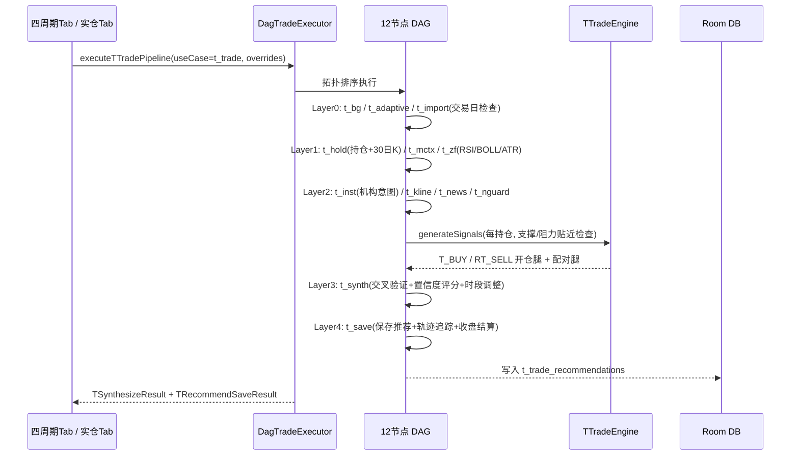
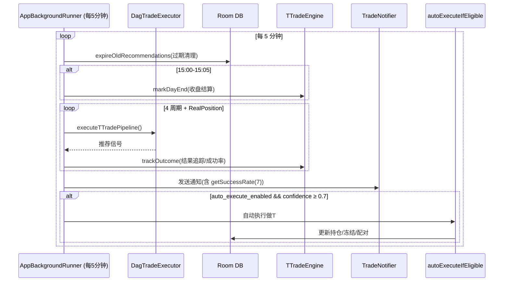

# 做T/反T 系统文档

> 实现文件：
> - 引擎：`strategy/trade/TTradeEngine.kt`、`strategy/trade/TTradeModels.kt`
> - Pipeline 节点：`strategy/topology/pipelines/TTradePipelineNodes.kt`
> - 时段策略：`strategy/topology/pipelines/TTimeSlotStrategy.kt`（**完整权重表已并入本文档第八节**，专项见 `t-trade-time-slots.md`）
> - 日内分析：`strategy/data/IntradayAnalyzer.kt`
> - Pipeline 定义：`assets/usecases/t_trade_pipeline.xml`、`t_trade_usecase.xml`
> - 执行器：`strategy/topology/xml/DagTradeExecutor.kt`（`executeTTradePipeline`）
> - 后台监控：`stock/database/AppBackgroundRunner.kt`（`monitorTTradeOpportunities`）
> - 通知：`notification/TradeNotifier.kt`
> - UI 展示：`strategy/trade/QuantFragmentBase.kt`（四周期Tab内做T面板）、`strategy/trade/RealHoldingQuantFragment.kt`（实仓Tab做T入口）

---

## ⏱ UI 展示入口（速查）

做T/反T 信号与执行结果在 App 内有 **4 类展示入口**：

| 入口 | 位置 | 内容 |
|------|------|------|
| ① 四周期 Tab 做T面板 | 策略 Tab（0-3）各周期 Fragment 内的「做T/反T」卡片（`QuantFragmentBase`） | 当日做T信号列表：趋势预警、置信度、RSI、量比、K线形态；点击可查看/执行 |
| ② 实仓 Tab 做T入口 | 策略 Tab[4] 实仓页（`RealHoldingQuantFragment`） | 持仓渲染后自动 `checkRealPositionTSignals()`；「持仓管理」菜单含做T信号记录/推荐记录管理 |
| ③ 系统/微信通知 | 状态栏 + ServerChan/PushPlus（`TradeNotifier`） | 后台每 5 分钟监控推送：做T信号 + 近7日成功率 + 自动执行结果 |
| ④ 数据清理入口 | 实仓 Tab「持仓管理 → 清空实仓数据」 | 清理 `t_trade_records` / `t_trade_recommendations`（测试辅助） |

> 实仓 Pipeline 渲染图（`RealHoldingQuantFragment` 内嵌 HTML）中，L4 操作层即为「做T/反T建议」节点。

---

## 一、做T/反T 基本概念

做T 是利用**已有底仓**在一天内完成「先买后卖」或「先卖后买」，赚取日内差价、摊低持仓成本的操作。系统用 `TTradeType` 区分四条腿：

| 枚举 | 含义 | 角色 |
|------|------|------|
| `T_BUY` | 正T买入（开仓腿） | 低吸：贴近支撑位买入，产生信号 |
| `T_SELL` | 正T卖出（配对腿） | 高抛：与 T_BUY 配对，回落回升后卖底仓 |
| `RT_SELL` | 反T卖出（开仓腿） | 高抛：贴近阻力位先卖底仓，产生信号 |
| `RT_BUY` | 反T买入（配对腿） | 低接：与 RT_SELL 配对，回落再接回 |

**配对规则**（引擎 `executeTTrade` 中强制）：
- `T_SELL` 必须配对 `T_BUY`；`RT_BUY` 必须配对 `RT_SELL`
- 开仓腿执行时自动生成配对腿记录，配对腿带 `pairId` 指向开仓腿
- **孤儿记录防护**：配对失败时返回 `0L`，不产生无主记录，避免脏数据

---

## 二、做T DAG Pipeline 架构

`t_trade_pipeline.xml` 定义 **12 节点 / 5 层 DAG**（7 个复用节点 + 5 个新建节点）：

```
Layer 0  并行基础   t_bg(后台暂停/恢复)   t_adaptive(大盘+外盘+自适应)   t_import(交易日检查)
                      └──────────────────┼──────────────────────────┘
Layer 1  并行数据   t_hold(持仓载入+日K)   t_mctx(板块上下文)           t_zf(技术因子 RSI/BOLL/ATR)
                      │  ┌───────────────┼───────────────────────┐
Layer 2  并行分析   t_inst(机构意图)     t_kline(K线形态)   t_news(新闻热度)   t_nguard(新闻黑名单)
                      │  ┌──────────────┴───────────────────────────┘
Layer 3  聚合评分   t_synth(交叉验证+置信度评分)
                      │
Layer 4  保存结算   t_save(建议保存+追踪结算)
```

| 层 | 节点 | 模块 | 类型 | 职责 |
|----|------|------|------|------|
| 0 | `t_bg` | bg_manager | 复用 | 后台暂停/恢复 |
| 0 | `t_adaptive` | adaptive_params | 复用 | 大盘方向 + 外盘情绪 + 自适应参数 |
| 0 | `t_import` | t_trade_import | 新建 | 交易日检查（休市则跳过） |
| 1 | `t_hold` | t_holdings_load | 新建 | 载入模拟持仓 + 真实持仓 + 30日K线 + 基础指标 |
| 1 | `t_mctx` | market_context | 复用 | 板块上下文 |
| 1 | `t_zf` | zipline_factor | 复用 | RSI / BOLL / ATR 技术因子 |
| 2 | `t_inst` | t_inst_intent | 新建 | **日K机构意图判断**（量价+K线+RSI+布林+均线） |
| 2 | `t_kline` | candle_pattern | 复用 | K线形态识别（看多/看空形态） |
| 2 | `t_news` | news_strength | 复用 | 新闻热度（0-100） |
| 2 | `t_nguard` | news_guard | 复用 | 新闻黑名单过滤（输出被挡股票集合） |
| 3 | `t_synth` | t_signal_synthesize | 新建 | **聚合**：交叉验证 + 置信度评分 + 去重 |
| 4 | `t_save` | t_recommend_save | 新建 | 保存推荐 + 价格轨迹追踪 + 收盘结算 |

执行入口：`DagTradeExecutor.executeTTradePipeline()` 以 `t_trade` useCase 加载，携带 overrides 运行，提取 `t_synth`（`TSynthesizeResult`）与 `t_save`（`TRecommendSaveResult`）输出。

### 执行时序图



---

## 三、持仓载入与基础指标（t_hold）

`THoldingsLoadNode` 合并两类持仓：
1. **模拟持仓**：`strategyTradeOrderDao` 中 `BUYING/PENDING` 且 orderType 匹配当前周期（ultra_short→`ultra_short`，short→`shortterm`，mid→`midterm`，long→`long_term`）
2. **真实持仓**：`realPositionDao.getAllActive()`，periodType=`RealPosition`

每支持仓读取 30 日 K 线，计算 `THoldingBasics`：

| 指标 | 公式 |
|------|------|
| MA5/MA10/MA20 | 最近 5/10/20 日收盘均值 |
| 支撑位 | `max(20日最低, MA5×0.98, MA10×0.97)` |
| 阻力位 | `min(20日最高, MA5×1.02, MA10×1.03)` |
| 日均振幅 | 最近 10 日 `(high-low)/close` 均值 |
| 量比 | 当日成交量 / 前 4 日均量 |
| 价格位置 | `(close - 20日最低) / (20日最高 - 20日最低)`，0=布林下轨，0.5=中轨，1=上轨 |

---

## 四、信号生成（TTradeEngine.generateSignals）

为每支持仓生成开仓腿信号，核心条件：

- **贴近关键位**：买价 ≤ 支撑位×1.02（贴近支撑 2% 以内）→ `T_BUY`；卖价 ≥ 阻力位×0.98 → `RT_SELL`
- **期望利润**：`(阻力位 - 买价)/买价 > 0.5%`（正T）；`(卖价 - 支撑位)/卖价 > 0.5%`（反T）
- **数量**：`max(底仓 × 40%, 100)`，取整至 100 的倍数
- 结合 RSI（14 周期）、量比、K线形态、趋势方向综合判定

配对腿（`T_SELL` / `RT_BUY`）直接以高优先级（confidence=0.8）保存，无需评分。

---

## 五、机构意图判断（t_inst）

`TInstIntentNode.analyzeInstitutionalIntent` 综合 6 路信号：

1. **量价分析**：5日均量 vs 10日均量 → 放量(>1.1×)/缩量(<0.9×)/平量；结合 5 日涨跌幅 → `放量滞涨/放量上涨/放量下跌/量缩价稳/量缩回调/量缩反弹`
2. **K线特征**：5 日内下影线计数（下影>实体1.5倍）、上影线计数、阳线/阴线计数 → `连续下影线(承接)/连续上影线(抛压)/连续阳线/连续阴线`
3. **RSI 区间**（14 周期）：oversold(<30) / weak(<45) / neutral(<55) / strong(<70) / overbought(≥70)
4. **布林带位置**：lower(<0.2) / lower_middle(<0.4) / middle(<0.6) / upper_middle(<0.8) / upper(≥0.8)
5. **均线排列**：MA5>MA10>MA20（多头）或反之（空头）
6. **外盘情绪**：`context.getMarketReport()?.overseas` 的方向与影响提示

判定优先级（`InstIntent` 五分类）：

| 优先级 | 条件 | 结论 | 方向 |
|--------|------|------|------|
| 1 | 均线多头 + 阳线≥3 + 非缩量 + 5日涨>3% | `PULLING_UP` 拉升中 | hold（不宜做T，防卖飞） |
| 2 | 量缩价稳 + 下影线≥2 + RSI∈[35,50] + 布林<0.4 | `SHAKING` 震仓洗盘 | favor_正T（最佳低接） |
| 3 | 量缩价稳 + RSI∈[30,50] + 布林<0.5 | `ACCUMULATING` 建仓吸货 | favor_正T |
| 4 | 放量滞涨 + 上影线≥2 + RSI>65 | `DISTRIBUTING` 出货 | favor_反T |
| 5 | 放量下跌 + 阴线≥3 | `DISTRIBUTING` 出货 | favor_反T |
| 6 | 外盘偏空 + RSI>60 | `DISTRIBUTING` 出货 | favor_反T |
| 7 | 外盘偏多 + RSI<40 + 布林<0.3 | `ACCUMULATING` 建仓吸货 | favor_正T |
| 8 | 其余 | `NEUTRAL` 无法判断 | neutral（观望） |

---

## 六、置信度评分公式（t_synth）

`TSignalSynthesizeNode` 以 **50 分基准**逐项加减分，仅对**开仓腿**（T_BUY / RT_SELL）评分：

| 因子 | 加分 | 减分 | 说明 |
|------|------|------|------|
| 机构意图 | +20 | -15 / -30 | T_BUY 且建仓/震仓 +20；RT_SELL 且出货 +20；RT_SELL 且拉升中 **-30**；T_BUY 且出货 -15；RT_SELL 且建仓/震仓 -15 |
| K线形态 | +15 | -10 | T_BUY 且看多 +15；RT_SELL 且看空 +15；方向矛盾 -10 |
| 外盘情绪 | +10 | -5 / -15 | T_BUY 且外盘多 +10；RT_SELL 且外盘空 +10；反向：正T 且空 -15，反T 且多 -5 |
| 新闻 | +5 | -20 | news_strength>60 正面 +5；命中黑名单 -20（黑名单直接阻挡） |
| 技术指标 | +10 | -10 | T_BUY 且 RSI∈[30,50] +10；RT_SELL 且 RSI∈[65,85] +10；日均振幅<1.5% -10 |
| **日内冰点/沸点** | +15 | -10 | T_BUY 且日内位置≤0.2（冰点）低吸 +15；RT_SELL 且位置≥0.8（沸点）高抛 +15；反向 -10 |
| 大盘方向 | — | -10 | 空头大盘做正T -10；多头大盘做反T -10 |
| **时段调整** | ± | — | 由 `TTimeSlotAdjuster.adjust()` 返回 `tBuyScoreAdj` / `rtSellScoreAdj` 叠加 |

**置信度与优先级**：

```
rawConfidence = (score / 100).coerceIn(0.0, 1.0)
confidence    = (rawConfidence × timeAdj.confidenceScale).coerceIn(0.0, 1.0)
优先级: confidence ≥ 0.7 → HIGH；≥ 0.5 → MEDIUM；否则 LOW
```

**过滤规则**（`filteredCount`）：
- 非交易时段（`NON_TRADING`）直接过滤
- `confidence < minConfidence(0.3)` 过滤
- 命中新闻黑名单且为 T_BUY 直接阻挡

**去重**：每只股票最多保留 1 个开仓腿信号（正T/反T 互斥，取置信度高者），配对腿独立保留。

---

## 七、日内冰点/沸点（买在冰点，卖在沸点）

`IntradayAnalyzer.analyze()` 基于日内分时 K 线计算 **VWAP、MA5/10/20、价格位置、量比、线性回归趋势方向**：

- `pricePosition ≤ 0.2` → **冰点**：日内超跌，T_BUY 低吸 +15，RT_SELL 杀跌 -10
- `pricePosition ≥ 0.8` → **沸点**：日内超涨，RT_SELL 高抛 +15，T_BUY 追高 -10

---

## 八、时段权重（t_synth 叠加）

`TTimeSlotStrategy` 将全天划分为 **9 个交易时段 + NON_TRADING**，每个时段定义 `tBuyAdjust` / `rtSellAdjust` / `confidenceScale`：

| 时段 | 口诀 | 正T调整 | 反T调整 | 置信度缩放 |
|------|------|---------|---------|-----------|
| 9:30-9:40 早盘冲高 | 跑 | -25 | +20 | 90% |
| 9:50-10:10 短期高点 | 跑 | -15 | +15 | 85% |
| 10:10-10:40 主力动向 | 看 | -5 | -5 | 70% |
| 10:40-11:10 上午正常 | 正常 | 0 | 0 | 100% |
| 11:10-11:30 午盘急拉陷阱 | 防 | -20 | +10 | 80% |
| 13:00-13:30 午后开盘杀 | 防 | -15 | +10 | 85% |
| 13:30-14:00 垃圾时间 | 等 | -10 | -10 | 60% |
| 14:00-14:30 方向选择 | 盯 | +10 | +10 | 100% |
| 14:30-15:00 定调时刻 | 决 | +15 | +15 | 110% |

> 详见 `docs/topology/t-trade-time-slots.md`。

---

## 九、推荐保存与结算（t_save）

`TRecommendSaveNode` 三步：

1. **保存推荐**：将置信度/机构意图/K线形态/时段编入 reason 前缀：
   `[置信度65%|机构:震仓洗盘|十字星|⏰主力动向] +20(机构), +10(技术) | 原始reason`
2. **价格轨迹追踪**：读当日日K收盘价，调用 `trackOutcomeForRecommendations` 跟踪已推荐记录的走势
3. **收盘结算**：15:00~15:05 调用 `markDayEnd` 做收盘结算

---

## 十、后台监控与自动执行

`AppBackgroundRunner.monitorTTradeOpportunities()`（每 5 分钟）：

### 监控时序图



流程步骤：
2. **收盘结算**：15:00-15:05 执行收盘结算
3. **周期执行**：对 4 个周期（ultra_short / short / mid / long）+ **RealPosition** 各执行一次做T Pipeline（内部捕获 `Exception`，失败不影响监控循环）
4. **结果追踪**：跟踪持仓结果，统计成功/失败
5. **通知**：通过 `TradeNotifier`（系统 + ServerChan + PushPlus）发送，附带**成功率摘要**（`getSuccessRate(7)` 近 7 日）
6. **自动执行**：调用 `autoExecuteIfEligible()`，受两开关控制：
   - `auto_execute_enabled`（默认 `false`）
   - `auto_execute_threshold`（默认 `0.7`，置信度 ≥ 阈值才自动执行）
   - 通过 `notified_rec_ids` 去重，只保留最近 200 条记录

---

## 十一、成功率统计反馈闭环

`TTradeSuccessRate` 按方向统计：

- **统计维度**：按 `TTradeType`（T_BUY / T_SELL / RT_SELL / RT_BUY）分别统计
- **胜负判定**：已执行的记录用 `isExecutedProfitable`（按方向判断已执行是否盈利）：
  - 买入腿（T_BUY / RT_BUY）：执行价 < 当前价 → 盈利
  - 卖出腿（T_SELL / RT_SELL）：执行价 > 当前价 → 盈利
- **口径**：`getSuccessRate(7)` 取最近 7 天，成功率 = 盈利次数 / 已执行次数
- **闭环**：成功率摘要随每日通知推送，同时影响后续信号生成与自动执行阈值判断

---

## 十二、关键修复记录

| 编号 | 问题 | 修复 |
|------|------|------|
| P1-6 | 配对腿孤儿记录 | 配对时返回 `0L`，杜绝无主配对记录 |
| P1-5 | 成功率统计不区分方向 | 按方向统计，`isExecutedProfitable` 按腿类型判定盈亏 |
| P2-13 | 配对腿不参与结算 | 目标触及/收盘结算包含配对腿记录 |

---

## 十三、风险提示

- T 仓当日了结，不变成加仓
- 做错 T 不恋战，按原止损线处理
- 分时背离只管短期（一二十分钟或日内一两个小时）
- 切忌贪心，有几个点的差价便已足够
- 震荡市或高波动行情中做 T 效果最佳
