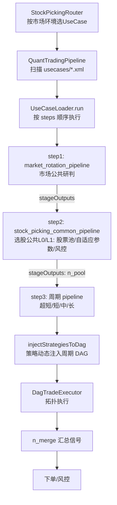

# UseCase / Pipeline 架构说明（usecases XML 体系）

> 本文档说明 `app/src/main/assets/usecases/` 下所有 XML 文件的职责、执行流程与关键机制，
> 以及本批次改造的实现计划与状态。

---

## 1. 文件职责清单

### 1.1 编排层（UseCase，4 个）

UseCase 是顶层执行单元，按 `<steps>` 顺序依次执行多个 pipeline。**所有节点输出统一写入
共享的 `PipelineContext.stageOutputs`，跨 pipeline 持久**，后续 pipeline 无需显式边即可读取。

| 文件 | 职责 | steps 顺序 |
|---|---|---|
| `ultra_short_usecase.xml` | 超短线 UseCase 编排 | 市场研判 → 选股公共L0/L1 → 超短线 pipeline |
| `short_term_usecase.xml` | 短线 UseCase 编排 | 市场研判 → 选股公共L0/L1 → 短线 pipeline |
| `mid_term_usecase.xml` | 中线 UseCase 编排 | 市场研判 → 选股公共L0/L1 → 中线 pipeline |
| `long_term_usecase.xml` | 长线 UseCase 编排 | 市场研判 → 选股公共L0/L1 → 长线 pipeline |

### 1.2 公共 pipeline（2 个，四周期共用）

| 文件 | 职责 | 关键节点 |
|---|---|---|
| `market_rotation_pipeline.xml` | **市场公共研判**（不碰个股）：大盘六维研判 → 板块强弱 → 风格轮动，输出 `n_a_market` / `n_sector_strength` / `n_style_rotation` | `n_import` → `n_a_market`、`n_sector_strength` → `n_style_rotation` |
| `stock_picking_common_pipeline.xml` | **选股公共数据准备层**（原 `common_l0_l1_pipeline.xml` 更名）：数据导入检查 → 市场上下文 → 自适应参数 → 股票池 → 大盘均线检查 → 持仓风控，输出 `n_pool` 等 | L0：`n_import`/`n_ctx`/`n_bg`/`n_adaptive`；L1：`n_pool`/`n_ma_unified`/`n_guard` |

### 1.3 周期私有 pipeline（4 个，仅保留 L2+ 节点）

| 文件 | 职责 | 说明 |
|---|---|---|
| `ultra_short_pipeline.xml` | 超短线选股/风控/信号 | L0/L1 已抽取至公共层，仅保留 L2 以上节点 |
| `short_term_pipeline.xml` | 短线选股/风控/信号 | 同上 |
| `mid_term_pipeline.xml` | 中线选股/风控/信号 | 同上 |
| `long_term_pipeline.xml` | 长线选股/风控/信号 | 同上 |

### 1.4 相关 Java 类

| 类 | 职责 |
|---|---|
| `StockPickingRouter.kt` | Agent 入口：按市场环境（`n_a_market`/`n_style_rotation`）选择 UseCase |
| `QuantTradingPipeline.kt` | 顶层入口：扫描 `assets/usecases/*.xml`，逐个运行 |
| `UseCaseLoader.kt` | 解析 UseCase XML；按 steps 顺序执行 pipeline；`injectStrategiesToDag` 动态注入策略节点 |
| `DagTradeExecutor.kt` | 单个 DAG 的拓扑执行（`DagPipeline` 解析 + 分层调度） |
| `NodeRegistry.kt` | `module` 名 → 节点工厂注册表 |
| `PipelineContext.kt` | 跨 pipeline 共享上下文（`stageOutputs`、自适应参数、持仓） |

---

## 2. 整体执行流程



ASCII 版：

```
StockPickingRouter (市场环境路由)
      │ 选择 UseCase
      ▼
QuantTradingPipeline (扫描 4 个 usecase 并运行)
      │
      ▼
UseCaseLoader.run ── 按 <steps> 顺序执行
      │
  ┌───┴──────────┬───────────────┬───────────────┐
  │ step1        │ step2         │ step3         │
  ▼              ▼               ▼               │
市场公共研判   选股公共L0/L1    周期私有 pipeline  │
market_rotation stock_picking_  超短/短/中/长      │
               common            │               │
  │ n_a_market  │ n_pool         │ 策略动态注入    │
  │ n_sector    │ n_adaptive     │ (injectStrategiesToDag)
  │ n_style     │ n_ma_unified   │               │
  └──────┬──────┴───────┬────────┴───────────────┘
         ▼              ▼
  stageOutputs（跨 pipeline 共享，全部写入 PipelineContext）
  n_pool / n_adaptive / n_orders / n_a_market / n_sector_strength / n_style_rotation ...
```

---

## 3. 各 pipeline 内部 DAG

### 3.1 `market_rotation_pipeline.xml`（市场公共研判）

```
n_import ──→ n_a_market ─┐
   │                      ├──→ n_style_rotation
   └────────→ n_sector_strength ─┘
```

输出到 `stageOutputs`：`n_a_market`、`n_sector_strength`、`n_style_rotation`。

### 3.2 `stock_picking_common_pipeline.xml`（选股公共 L0/L1）

```
Layer 0（并行）            Layer 1（并行）
n_import ──────────────→ n_pool（股票池）
n_ctx（市场上下文）──────→ n_pool
                           n_ma_unified（大盘均线检查）
n_ctx ──────────────────→ n_guard（持仓风控）
n_bg（后台暂停/恢复）
n_adaptive（自适应参数）→ 写入 context
```

关键输出：`n_pool`（选股基础池）、`n_adaptive`（自适应参数，写入 context）。

### 3.3 周期私有 pipeline（以 `short_term_pipeline.xml` 为例）

```
n_cand（候选池，根节点，从 stageOutputs 兜底读 n_pool）
   ├──→ n_heat（热度评分）
   └──→ n_orders（订单信号）        （策略节点由 injectStrategiesToDag 动态注入）
          │
          ▼
       n_merge（信号汇总） → 风控/下单
```

- `n_cand` 等为**根节点**：通过 `context.getStageOutput("n_pool")` 兜底读取股票池
- 策略节点由 `UseCaseLoader.injectStrategiesToDag` 动态注入，挂在 `n_merge` 之前

---

## 4. 关键机制

### 4.1 跨 pipeline 数据共享（stageOutputs）

每个 pipeline 执行完毕后，节点输出不会丢失——全部缓存在 `PipelineContext.stageOutputs`。
因此周期 pipeline 内以根节点形式出现的 `n_cand`、策略节点等，均可直接读取
前面公共 pipeline 产生的 `n_pool` / `n_adaptive` 等输出，无需跨 XML 建边。

### 4.2 策略动态注入（injectStrategiesToDag）

**主要功能**：把系统中注册的**所有选股策略**（`NodeRegistry.listModules()` 中 `strategy:` 前缀的模块，
每个策略对应一个 `StrategyNode`）以 `strategy_0..N` 节点的形式**动态挂入周期 DAG 的 `n_merge`（信号合并）节点之前**。
执行时每只股票先经过全部策略打分，再统一汇总到 `n_merge` 产出信号——策略与周期 pipeline 的 XML 完全解耦。

**在哪里执行**：`UseCaseLoader.run()` 解析 usecase `<steps>` 时（`UseCaseLoader.kt:170`），
对**每个 V2 DAG pipeline step** 调用 `injectStrategiesToDag(dagPipeline, useCasePeriod)`，
用注入后的 DAG 替换原 pipeline，随后才交给 `DagTradeExecutor` 执行：

```
UseCaseLoader.run()
  └─ for step in useCase.steps
       └─ step 是 DAG pipeline
            ├─ PipelineXmlParser.loadDagPipelineFromAssets(...)   // 读 XML
            └─ injectStrategiesToDag(dag, useCasePeriod)          // ← 策略注入
                 └─ loadedDagPipelines.add(name to enrichedDag)   // 注入后执行
```

**注入逻辑（4 步）**：
1. **收集策略**：`NodeRegistry.listModules()` 过滤 `strategy:` 前缀 → 逐一 `createNode` 生成 `StrategyNode`
2. **周期过滤**：只注入 `strategy.holdingPeriods` 含当前 usecase 周期的策略（`periodStr` 为 null 时全部注入；
   中线 pipeline 不会跑超短线策略，反之亦然）
3. **接入点**：找 `n_merge` 节点；每个策略建 `strategy_i → n_merge` 边；同时**移除原有 `n_pool → n_merge`
   直连边**，让策略成为「选股结果 → 信号」之间的中间层
4. **输入边（n_pool 兜底）**：见下方 4.3

**边界情况**：无匹配周期策略 → 跳过注入并告警；DAG 中无 `n_merge` → 跳过注入（策略不生效）。

### 4.3 n_pool 不在周期 pipeline 的场景（本次改造核心）

**背景**：L0/L1 抽取后，`n_pool` 只存在于 `stock_picking_common_pipeline.xml`（step2），
周期 pipeline（step3）内没有 `n_pool` 节点。若仍给策略节点加 `n_pool → 策略` 边，会出现
**悬空边（引用了 DAG 中不存在的节点），导致拓扑校验失败 / 死锁**。

**实现（简单方式）**：`injectStrategiesToDag` 先检测周期 DAG 中是否存在 `n_pool` 节点：
- **存在**（旧式 / 单 pipeline 场景）：保留 `n_pool → 策略` 边，走显式输入
- **不存在**（本场景）：策略节点不建 `n_pool` 边，直接以根节点身份运行，
  `StrategyNode.execute` 内部按 `input → getStageOutput("stock_pool") → ("n_pool")
  → ("candidate_pool") → ("n_cand") → 空池` 依次兜底读取

```kotlin
// UseCaseLoader.injectStrategiesToDag（核心片段）
val hasPoolNode = dag.nodes.any { it.nodeId == "n_pool" }
for (strategyNode in strategyDagNodes) {
    if (hasPoolNode) {
        newEdges.add(DagEdge("n_pool", 0, strategyNode.nodeId, 0)) // 有池节点：显式建边
    }
    // 无池节点：不加 n_pool 边，策略节点以根节点运行，从 stageOutputs 兜底读池
    newEdges.add(DagEdge(strategyNode.nodeId, 0, "n_merge", 0))
}
```

```kotlin
// StrategyNode.execute（兜底读取股票池）
val pool: StockPool = when (input) {
    is StockPool -> input
    else -> context.getStageOutput<StockPool>("stock_pool")
        ?: context.getStageOutput<StockPool>("n_pool")
        ?: context.getStageOutput<StockPool>("candidate_pool")
        ?: context.getStageOutput<StockPool>("n_cand")
        ?: StockPool(emptyList(), "empty")
}
```

---

## 5. 本批次实现计划与状态

| # | 任务 | 状态 |
|---|---|---|
| 1 | `common_l0_l1_pipeline.xml` 更名 → `stock_picking_common_pipeline.xml`（内部 id 同步改为 `stock_picking_common_dag`） | ✅ 完成 |
| 2 | 4 个 usecase 的 steps 中补引选股公共 pipeline（market_rotation → **stock_picking_common** → 周期 pipeline） | ✅ 完成 |
| 3 | 4 个周期 pipeline 注释中的 `common_l0_l1_pipeline.xml` 引用更新为新名 | ✅ 完成 |
| 4 | 删除遗留旧文件 `common_l0_l1_pipeline.xml`（需文件系统操作） | ⏳ 待删除 |
| 5 | `injectStrategiesToDag` 支持 `n_pool` 不在周期 pipeline（hasPoolNode 检测 + StrategyNode 兜底读池） | ✅ 已完成并验证 |
| 6 | 本文档（文件职责 + 流程图 + 实现计划） | ✅ 完成 |

### 验证清单

- [ ] `injectStrategiesToDag` 生成的边集合中不包含悬空 `n_pool` 引用（拓扑校验通过）
- [ ] 周期 pipeline 执行时 `n_cand` / 策略节点能从 stageOutputs 读到 `n_pool` 股票池
- [ ] 四个 usecase 均按「市场研判 → 选股公共 → 周期」三步顺序执行
